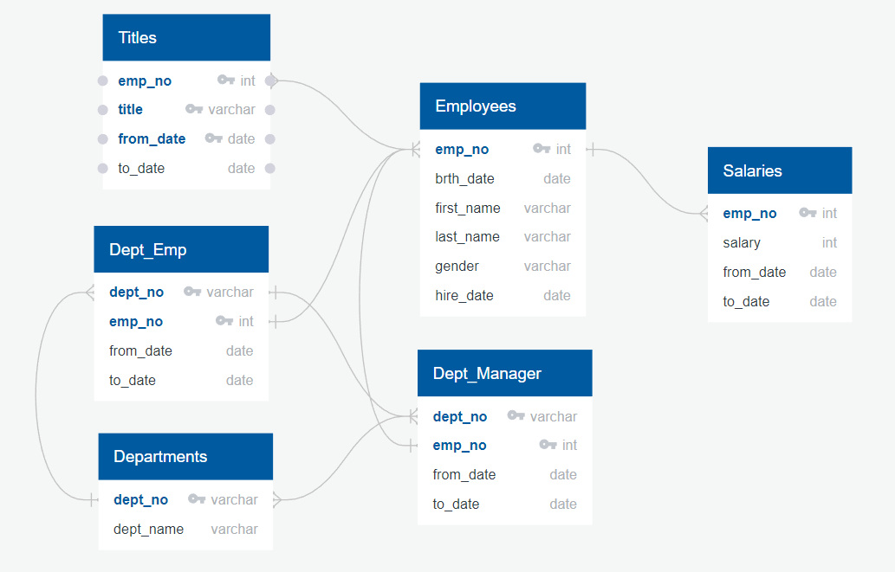
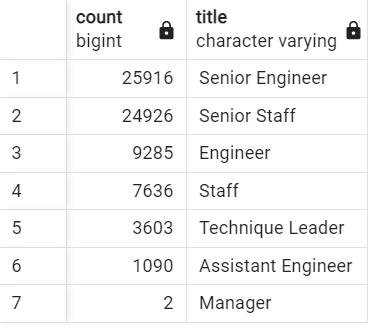
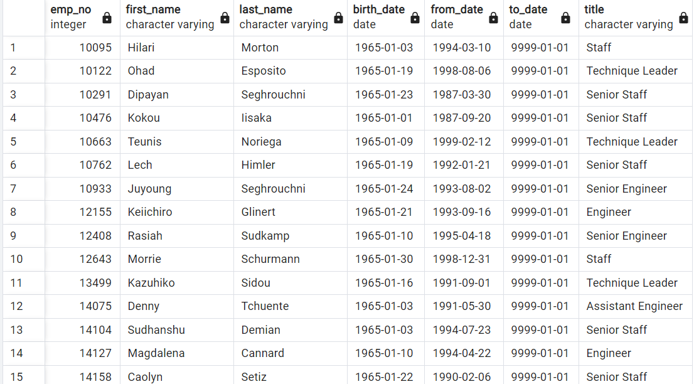
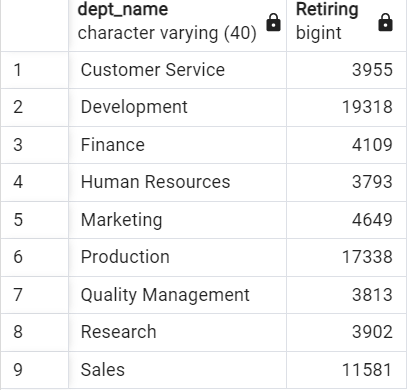
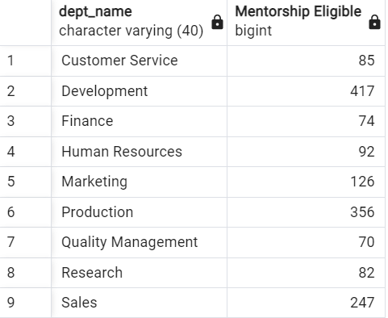

# Pewlett-Hackard-Analysis

## Purpose

Like many companies, Pewlett-Hackard is facing the "silver tsunami" as many of their employees reach retirement age. The potential retirement of a significant number of experienced employees presents a challenge to managment. The have request more information about this upcoming change in staffing, with particular regard to the possibility of a mentorship program to help younger but experienced employees quickly get up to speed and take over the duties of some who will retire.

The managment team specifically asked for a list of job titles that will be left open as employees retire. Further, they requested a list of employees who are potentially eligible for the proposed mentorship program.

## Methods and Tools

Pewlett-Hackard had not previously used a relational database to store their employee records. Using the .csv files provided a relational database was created. Requested information was retrieved by querying this database. The tools utilized include:

- PostgreSQL
- pgAdmin
- Microsoft Excel
- QuickDB

The organization of the original tables is shown below. Some possible connections between them have also been added.

## Results

- A count of the titles of current employees who are reaching retirement age suggests that the majority hold senior positions accross the company.

- The number of current employees reaching retirement age is 72,458.

- The number of current employees potentially eligible for the proposed mentorship program is 1,549. A significant assumption made to reach this number is that the employee is born in 1965. A snippit of this table is shown below:

- As seen above in the 'title' column, some of the eligible employees already hold senior positions and may not require mentoring support.

## Summary

Pewlett-Hackard can expect to lose up to 72,458 employees to retirement in the coming years. These losses depend on a number of factors such as retirement policy and benifits or incentives to stay on for a longer period of time.

The Proposed mentorship program could mitigate some of the effects, however, there are simply not enough employees who are considered eligible for this program based on the current criteria and many of them already hold senior positions. Below is a breakdown of the number of potentially retiring employees by department and the number of mentorship eligible by their most recent department.

While not intended as a 1 to 1 replacement model, it is clear that there are plenty of experienced mentors and a lack of people for them to mentor under the current standard of a 1965 birthday for eligibility.

### Further Inquiry

Although age can be an indicator of experience and seniority, generating mentorship candidates based on how long they have worked at Pewlett-Hackard may result in a larger group.

In addition to overall senority, the table "dept_emp" contains the required information to determine:

- Which departments an employee has worked in.
- How long they worked in each department.
- Which department they currently work in.

It may also be possible to "match" this information with the titles each employee has held to know if they held a Senior position in Sales but not after moving to Development.